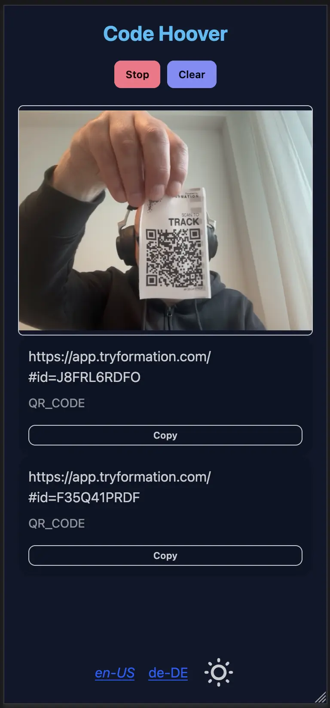

# Code Hoover

Code Hoover is a small web application that lets you scan QR codes and barcodes directly in the browser. It is written in Kotlin/JS using the fritz2 framework and relies on the excellent [ZXing JavaScript library](https://github.com/zxing-js/library) for the heavy lifting when decoding codes.

[](URL)

- Browser based and light weight.
- No ads, no nonsense.
- Quickly scan multiple qr or bar codes - the camera view stays open and tries to scan everything you point it at.
- Get a list of all the codes you scan
- Opens straight to your stash of codes so you're never starting from an empty page
- Copy the raw text to the clipboard or open links in a new tab
- Localized in multiple languages!
- Darkmode/lightmode support
- Sports a cute hoover favicon to tidy up your tabs

Is this useful? Maybe not for everyone. But I often want to know what the raw content of a QR or bar code is and that's what this is for.

Did I spend a lot of time on this app? It's all vibe coded using codex and some manual work.

## Building with Gradle

The Kotlin/JS build still produces a Webpack bundle. For a fast development loop run:

```bash
./gradlew jsBrowserDevelopmentWebpack --continuous
```

The `.run/webpack.run.xml` file contains an IntelliJ run configuration with this command so you can start it straight from the IDE.

For a production bundle use:

```bash
./gradlew jsBrowserProductionWebpack
```

## Running with Vite

Vite serves the output that Gradle produces. Install the node dependencies once:

```bash
npm install
```

Then start the dev server:

```bash
npm run dev
```

For a production build run:

```bash
npm run build
```

Unlike the normal Vite setup where it performs the bundling with esbuild, here Gradle already creates an `app.js` file. The Vite configuration in `vite.config.mjs` simply uses that file and adds Tailwind processing.

