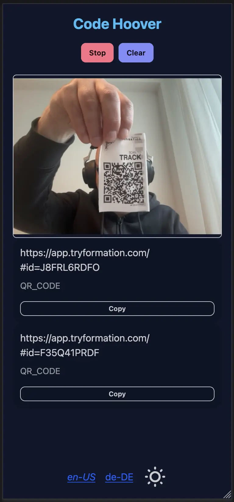

# Code Hoover

[codehoover.jillesvangurp.com](https://codehoover.jillesvangurp.com/)

Code Hoover is a small React web application for scanning, creating, and saving QR codes and barcodes directly in the browser. It prefers the native [Barcode Detection API](https://developer.mozilla.org/en-US/docs/Web/API/Barcode_Detection_API) when available and falls back to [@zxing/browser](https://github.com/zxing-js/browser).

[](https://codehoover.jillesvangurp.com/)

- Scan multiple QR codes and barcodes without closing the camera.
- Save, edit, delete, and reorder codes in local browser storage.
- Create URLs, text codes, WiFi credentials, and vCards.
- Import and export the saved stash as JSON.
- Copy raw values or open detected links.
- Use the app in English, German, Dutch, French, or Japanese.
- Follow the system light/dark preference and switch themes manually.
- Enable or disable scan and delete sounds.

## Development

The app uses React, TypeScript, Vite, Tailwind CSS 4, and daisyUI. Node.js 22.12 or newer is required.

```bash
npm install
npm run dev
```

Useful commands:

```bash
npm test       # run the Vitest suite
npm run lint   # run ESLint
npm run build  # type-check and create dist/
npm run check  # lint, test, and build
```

All application dependencies are managed through `package.json` and `package-lock.json`.

## Persisted data compatibility

The React implementation preserves the existing `localStorage` keys and the Kotlin serialization discriminator used by previous `codes.json` exports. Existing saved codes and exported files can therefore be used without migration.
